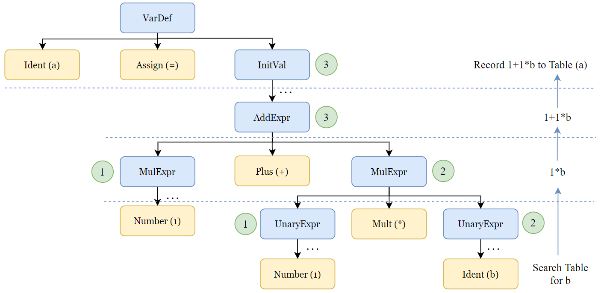
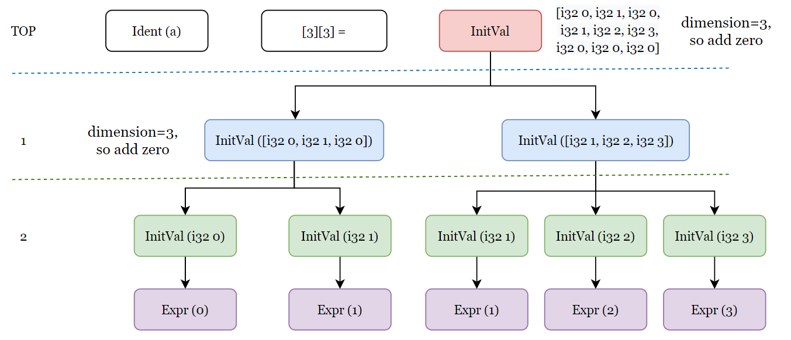

# 多维数组挑战实验报告

> 学号：19373257 姓名：黄泽桓

本次实验的实现逻辑主要在 lab7 和 lab8 中一起实现，因此在报告中，我将对前两次实验针对多维数组的实现进行阐述，部分内容不可避免会与前两次实验内容重复。

## 简要介绍

总体先回顾一下我的架构：

- lexer：输入源代码，输出 tokens
- descender：输入 tokens，递归下降手动生成语法树 AST
- generator：递归遍历语法树，记录符号表，进行语义判断和中间代码生成
- optimizer：输入中间代码，识别各代码块进行错误判断，如同一代码块重复 br 等

### 1 语法分析

```txt
Stmt         -> LVal '=' Exp ';'
                | [Exp] ';'
LVal         -> Ident {'[' Exp ']'}
```

首先，在语法分析构造语法树中，多维数组的文法（上述部分）中，Stmt 的两个候选式难以判断选择哪一分支，因为 Exp 最终可以推出 LVal，而 Lval 又可以作为 Stmt 的另一个候选式。我采用的方法是，识别到 Stmt 时，往后一直找，知道找到分号，若在分号前出现了赋值号，则走第一条候选式，而不是 Expr，这样就区别开了这两个候选式。

### 2 语义约束

#### 2.1 数组各维长度要求为**非负整数**的**常量表达式**

要求在编译时计算值，我给语法树各节点添加 intValue 属性，类似综合属性，对所有编译时可求值的变量进行求值：

- 首先需要判断是否可求值：符号表使用一属性记录符号是否可求值。获得该变量节点延伸出的所有叶子节点 leaf，若 leaf 为 Ident，则查符号表看它是否定义过且可求值；若不存在 Ident，则记表为可求值。
- 对于可求值的变量，在往下遍历语法树时，遇到节点可求值的则计算值，并存于节点属性中，回到父节点层面后取子节点的 intValue 或进行计算后作为当前节点的属性值。

比如代码为 `b=2;a=1+2*b`，则 a 的求值过程如下：



另外，关于常量表达式的判断，我也是获取该节点延申出的叶子节点，若含 Ident 则查表其是否为 Const 变量，不是则该表达式不是常量表达式。

#### 2.2 数组作为参数调用时形参和实参要求数目、类型对应该一致

这里的类型包括，INT、一维数组、二维数组、……；而数组类型的计算，需要考虑到数组定义的维度和被调用的维度，比如定义为`A[3][4][5]`，当调用时使用`A[2]`时，该变量表示”二维数组“，即 3-1=2。这样的话，要求函数形参声明为二维数组，传参才合理。

因此，我在语法树节点上添加数据维度 dimension 的属性，INT类型对应该值为0，数组类型对应该值为数组维度，在 Lval 节点中 LVal -> Ident {'[' Exp ']'}，使用定义维度数减去调用维度数，作为 dimension 值。该属性作为一个综合属性从叶节点往上传递至 Expr 节点，从而实现某个 Vn 的数据类型判断，机制与[#2.1](#2.1 数组各维长度要求为**非负整数**的**常量表达式**)intValue往上传递的机制一致。

### 3 数组处理

我将多维数组使用一维数组进行模拟从而实现，在处理过程中，主要围绕着树展开。以VarDef中的Array为例：（图仅作解释，不细节）


#### 3.1 数组初始化

数组初始化时，利用如上图的树结构，判断等号右边 InitVal 各部分对应的数组维度，并计算为一维数组的位置，具体为：

**局部数组初始化**

1. **计算和记录数组定义的维度信息：**

   递归探寻`[ConstExpr]`计算数组维度，记录维度于符号表和全局变量，同时相乘记为模拟一维数组总长度。比如`a[1][2]={}`，则在符号表中用数组的结构记录该符号维度为`1,2`，模拟一维数组的总长度为 1×2=2.

2. **使用 memset 初始化一维数组元素为 0**

3. **根据 InitVal 计算对应赋值的数组元素位置：**

   遇到InitVal子节点为Expr时，如上图中2的节点，此时往上找parent找到TOP层，获取当前属于哪一维；并在往上找的过程中，在每一层计算当前InitVal节点在当前层的序号，即与数组下标对应，如上图的Expr，在两层InitVal中它都在第一个，所以对应`Ident[0][0]`。

   当然，InitVal 层数对应维度数，若该维度数和声明的维度数不同，则报错。

4. **转化为模拟一维数组进行赋值：**

   已知数字总尺寸，例如`A[a][b][c]`，通过步骤2又找到了下标如`A[i][j][k]`，接着使用类似秦九韶算法，从左往右乘，`(((i*b)+j)*c)+k`，则可计算模拟一维数字位置，进行指针获取和赋值即可。

**全局数组初始化**

全局数组初始化生成的中间代码与局部数组不同，但一样是从上图的树结构出发解决。不同的是，在树节点属性 value 中，维护子节点的初始化信息。例如全局变量定义为：

```c
int a[3][3] = {{0,1},{1,2,3}};
```



则使用节点属性 value，记录当前节点的值，与 Expr 直接相连的 InitVal，需要记录值和值的类型，其它 InitVal 记录的值为其子节点 value 的组合，同时需要判断维数是否充分初始化，若存在空缺需要全部用 0 补齐。最后递归返回到初始化语句时，最顶层的 InitVal 的 value 值即为全局数组初始化的值。

#### 3.2 数组作赋值或被赋值使用

与初始化方式类似，只不过更简单些，因为元素位置已给出了，只需要使用[3.1 数组初始化](#3.1 数组初始化)步骤3计算元素在模拟一维数组的位置，然后进行赋值即可。

#### 3.3 数组作传参使用

数组作传参时，首先根据[2.2](#2.2 数组作为参数调用时形参和实参要求数目、类型对应该一致)判断实参类型与函数定义的形参类型是否对应一致。若有差别，则报错；若一致的话，则使用[3.1 数组初始化](#3.1 数组初始化)步骤3的类似秦九韶算法计算在模拟一维数组中的位置，然后 getelementptr 获取地址传入函数中。

需要注意的是，传参的数组元素可以与定义时维度长度不同，例如

```c
int a[2][3][4] = {};
func(a[1]);
```

此时，计算`a[1]`位置的过程为：

```c
((1*3+0)*4)+0
```

可以看到，当调用时比定义维度少时，需要在后面添加虚无的 0 进行模拟，这样才能正确计算位置，比如这里`a[1]`，就假设为`a[1][0][0]`计算位置了。

## 参考

主要参考教材和助教实验文档对编译过程的讲解，未参考其它具体的代码或教程。

