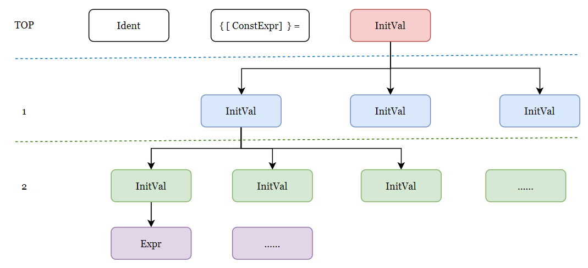

# Lab7 实验报告

> 学号：19373257 姓名：黄泽桓

## 简要介绍

本次实验实现了多维数组，主要功能实现或改动如下：

#### 语法分析

```txt
Stmt         -> LVal '=' Exp ';'
                | [Exp] ';'
LVal         -> Ident {'[' Exp ']'}
```

值得一提的是，要想实现多维数组，上面从完整文法中提取出来的一小部分出现了左递归，k维数组就需要往前看k步，我采用的方法是，识别到Stmt时，往后找`;`分号，若分号前出现`=`，则走第一条指令。

#### 语义分析

1. 编译阶段求值：首先我在符号表字段和语法树节点都添加了`intValue`元素，递归分析时，若变量能求值，则求值并在语法树向上传递，于Ident处记录符号表，实现了变量能在编译阶段求值则求值的功能。

2. 常量表达式判断：判断ConstExpr是否维常量表达式，则在语法树中获取该节点延申出去的叶节点，借助符号表判断其中的Ident是否为Const变量。

3. 数组下标非负整数判断：借助1实现

#### 对数组的处理

我将多维数组使用一维数组进行模拟从而实现，在处理过程中，主要围绕着树展开。以VarDef中的Array为例：（图仅作解释，不细节）



**数组初始化**时，利用如上图的树结构，判断等号右边 InitVal 各部分对应的数组维度，并计算为一维数组的位置，具体为：

1. 递归探寻`[ConstExpr]`计算数组维度，使用数组记录维度于符号表和全局变量，同时相乘记为模拟一维数组总长度
2. 遇到InitVal子节点为Expr时，如上图中2的节点，此时往上找parent找到TOP层，获取当前属于哪一维；并在往上找的过程中，在每一层计算当前InitVal节点在当前层的序号，即与数组下标对应，如上图对应`Ident[0][0]`
3. 已知数字总尺寸，例如`A[a][b][c]`，通过步骤2又找到了下标如`A[i][j][k]`，接着使用类似秦九韶算法，从左往右乘，`(((i*b)+j)*c)+k`，则可计算模拟一维数字位置，进行指针获取和赋值即可。

**数组元素赋值或使用**，与初始化方式类似，只不过更简单些，因为元素位置已给出了，只需要使用上述步骤3计算元素在模拟一维数组的位置即可。

## 参考

主要参考教材和助教实验文档对编译过程的讲解，未参考其它具体的代码或教程。

